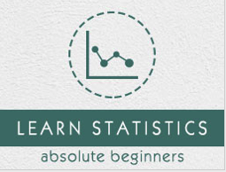

```
Roberto Nogueira  
BSd EE, MSd CE
Solution Integrator Experienced - Certified by Ericsson
```
# Tutorialspoint Statistics



**About This Tutorial**

This is to grasp rapidly the language and its concepts.

[Statistics Tutorial](https://www.tutorialspoint.com/statistics/index.htm)

#### Topics
```
Statistics Tutorial
[ ] Adjusted R-Squared
[ ] Arithmetic Mean
[ ] Arithmetic Median
[ ] Arithmetic Mode
[ ] Arithmetic Range
[ ] Bar Graph
[ ] Best Point Estimation
[ ] Binomial Distribution
[ ] Boxplots
[ ] Central limit theorem
[ ] Chebyshev's Theorem
[ ] Chi Squared table
[ ] Circular Permutation
[ ] Cluster sampling
[ ] Cohen's kappa coefficient
[ ] Combination
[ ] Combination with replacement
[ ] Comparing plots
[ ] Continuous Uniform Distribution
[ ] Cumulative Frequency
[ ] Co-efficient of Variation
[ ] Correlation Co-efficient
[ ] Cumulative plots
[ ] Cumulative Poisson Distribution
[ ] Data collection
[ ] Data collection - Questionaire Designing
[ ] Data collection - Observation
[ ] Data collection - Case Study Method
[ ] Data Patterns
[ ] Deciles Statistics
[ ] Dot Plot
[ ] F Test Table
[ ] Factorial
[ ] Frequency Distribution
[ ] Geometric Mean
[ ] Geometric Probability Distribution
[ ] Grand Mean
[ ] Harmonic Mean
[ ] Histograms
[ ] Hypergeometric Distribution
[ ] Hypothesis testing
[ ] Interval Estimation
[ ] Kolmogorov Smirnov Test
[ ] Kurtosis
[ ] Linear regression
[ ] Logistic Regression
[ ] Mcnemar Test
[ ] Mean Deviation
[ ] Means Difference
[ ] Multinomial Distribution
[ ] Negative Binomial Distribution
[ ] Normal Distribution
[ ] One Proportion Z Test
[ ] Outlier Function
[ ] Permutation
[ ] Permutation with Replacement
[ ] Pie Chart
[ ] Poisson Distribution
[ ] Pooled Variance (r)
[ ] Probability
[ ] Probability Additive Theorem
[ ] Probability Multiplecative Theorem
[ ] Probability Bayes Theorem
[ ] Probability Density Function
[ ] Process Sigma
[ ] Quartile Deviation
[ ] Range Rule of Thumb
[ ] Relative Standard Deviation
[ ] Reliability Coefficient
[ ] Required Sample Size
[ ] Residual sum of squares
[ ] Shannon Wiener Diversity Index
[ ] Signal to Noise Ratio
[ ] Simple random sampling
[ ] Skewness
[ ] Standard Deviation
[ ] Standard Error ( SE )
[ ] Standard normal table
[ ] Stem and Leaf Plot
[ ] Stratified sampling
[ ] Student T Test
[ ] Sum of Square
[ ] T-Distribution Table
[ ] Trimmed Mean
[ ] Weak Law of Large Numbers
[ ] Z tabe
Statistics Useful Resources
[ ] Statistics - Quick Guide
[ ] Statistics - Useful Resources
[ ] Statistics - Discussion
[ ] Selected Reading
[ ] Developer's Best Practices
[ ] Questions and Answers
[ ] Effective Resume Writing
[ ] HR Interview Questions
[ ] Computer Glossary
[ ] Who is Who
```

